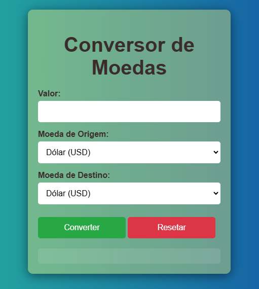
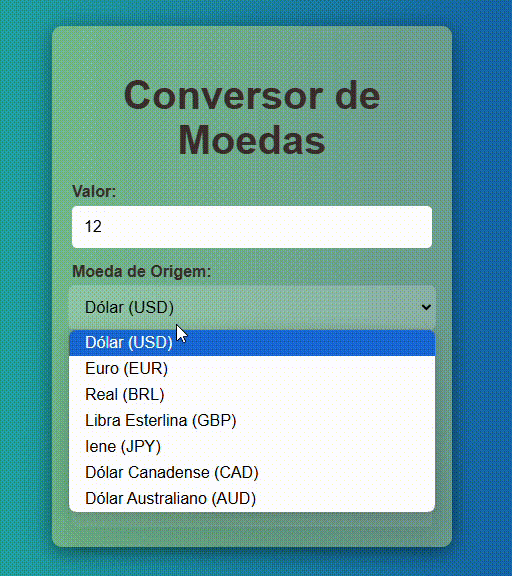

## descrição

## O que é?
Este é um projeto básico de um conversor de moedas criado com HTML, CSS e JavaScript. Ele permite que você digite um valor em uma moeda e veja o equivalente em outra moeda.

## Como usar:

Digite o valor: Insira o valor que você quer converter no campo indicado.
Escolha as moedas: Selecione a moeda que você está convertendo e a moeda para a qual você quer converter.
Clique em "Converter": O resultado da conversão aparecerá na tela.
Clique em "Resetar": Para limpar os campos e fazer uma nova conversão.

## Para que serve:

Viagens: Ajuda a planejar suas viagens, convertendo dinheiro para a moeda local.
Compras online: Verifica os preços de produtos em diferentes moedas.
Curiosidade: Descobre quanto vale o seu dinheiro em outras moedas.

## Como funciona:

HTML: Cria a estrutura da página, como os campos de texto, botões e a área onde o resultado será mostrado.
CSS: Define a aparência da página, como as cores, fontes e layout.
JavaScript: Faz os cálculos da conversão quando você clica no botão "Converter".

## O que você pode fazer:

Adicionar mais moedas: Você pode adicionar mais opções de moedas ao seu conversor.
Melhorar o design: Use suas habilidades em CSS para criar um design mais bonito e moderno.
Adicionar mais funcionalidades: Você pode adicionar outras funcionalidades, como um histórico de conversões ou gráficos.
Dica: Para aprender mais sobre HTML, CSS e JavaScript, você pode procurar tutoriais online ou livros sobre programação.

 

Observações:

Taxas de câmbio: As taxas de câmbio utilizadas neste conversor podem não ser as mais atualizadas. É sempre bom verificar as taxas em um site especializado antes de fazer qualquer transação financeira.
Segurança: Tenha cuidado ao compartilhar seus dados pessoais ao usar qualquer tipo de ferramenta online.

 
 
- A aplicação oferece uma interface gráfica onde o usuário pode:
    - **Selecionar a moeda de origem:** O usuário escolhe a moeda que deseja converter a partir de um menu dropdown.
    - **Informar o valor:** O usuário insere o valor numérico que deseja converter em um campo de texto.
    - **Selecionar a moeda de destino:** O usuário escolhe a moeda para a qual deseja converter o valor, também a partir de um menu dropdown.
    - **Obter o resultado:** Ao clicar no botão "Converter", o aplicativo realiza o cálculo e exibe o valor convertido na tela.
    - **Resetar os campos:** Um botão "Resetar" permite limpar os campos de entrada e o resultado para uma nova conversão.

 
  
 

## Tecnologias Utilizadas
 
* [<code></code>](https://developer.mozilla.org/pt-BR/docs/Web/HTML)
* [<code></code>](https://developer.mozilla.org/pt-BR/docs/Web/CSS)
* [<code></code>](https://developer.mozilla.org/pt-BR/docs/Web/JavaScript)
* [<code></code>](https://git-scm.com/)
* [<code></code>](https://bard.google.com/chat?hl=pt)
* [<code></code>](https://code.visualstudio.com/)
* [<code></code>](https://github.com/)
 
 
## Fontes Consultadas
 
* [Alura - Como escrever um bom README.md](https://www.alura.com.br/artigos/escrever-bom-readme)
* [Bootstrap](https://getbootstrap.com/docs/5.3/forms/checks-radios/#radios)
* [Alura - Tipos de type](https://cursos.alura.com.br/forum/topico-type-do-campo-telefone-104370)
* [Dio](https://www.dio.me/articles/tutorial-criando-um-readme-bonitao-para-o-seu-github)
* [Progamador alternativo - Youtube](https://youtu.be/HJ16WEmOWTw?si=UFvCAtBHbuCc08Hu)
* [Fotos para o subtópico "Técnicas e tecnologias consultadas"](https://github.com/alexandresanlim/Badges4-README.md-Profile)
* [Youtube - TELA DE LOGIN COM TEMA DARK | HTML + CSS](https://youtu.be/69-WfrVBli8?si=GGultNVszQg0wDUK)
* [HomeHost](https://www.homehost.com.br/blog/tutoriais/html-buttton/)
* [W3schools](https://www.w3schools.com/js/js_window_location.asp)
 
 
## Colaboradores
| [ Fellipe Zanin](https://github.com/Fell1pe) |  [ Ana Luiza](https://github.com/AnaLu1za) |
| :---: | :---: |
 
 
 
## Autor
Felipe André de Freitas [GitHub]